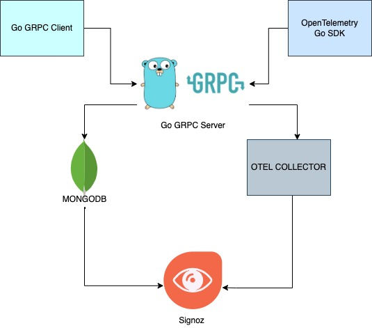

### Distributed Tracing Go Grpc Sample

This project demonstrates how to implement distributed tracing in go grpc application.

This application uses mongodb as the database, so make sure to create an employeedb database and employee collection in mongodb and run this app.

### Tracing flow



### Running the code

Start go grpc server and grpc client using below commands

1. Grpc-Server
```
cd server
go run server.go
```

2. Grpc-Client
```
cd client
go run client.go
```

View traces, logs and metrics:

- View the metrics in signoz, go to http://localhost:3301/application 
